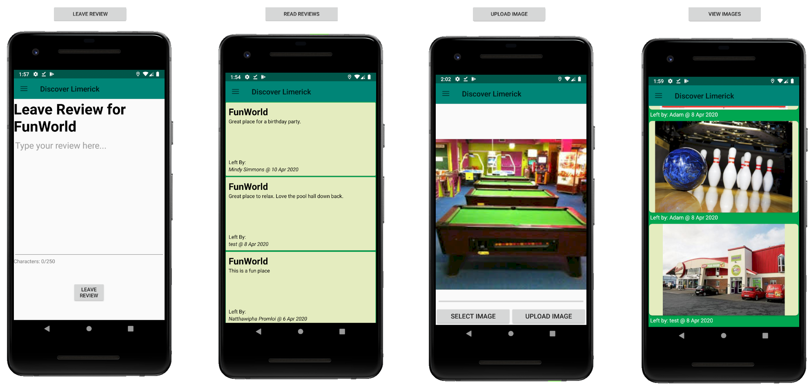
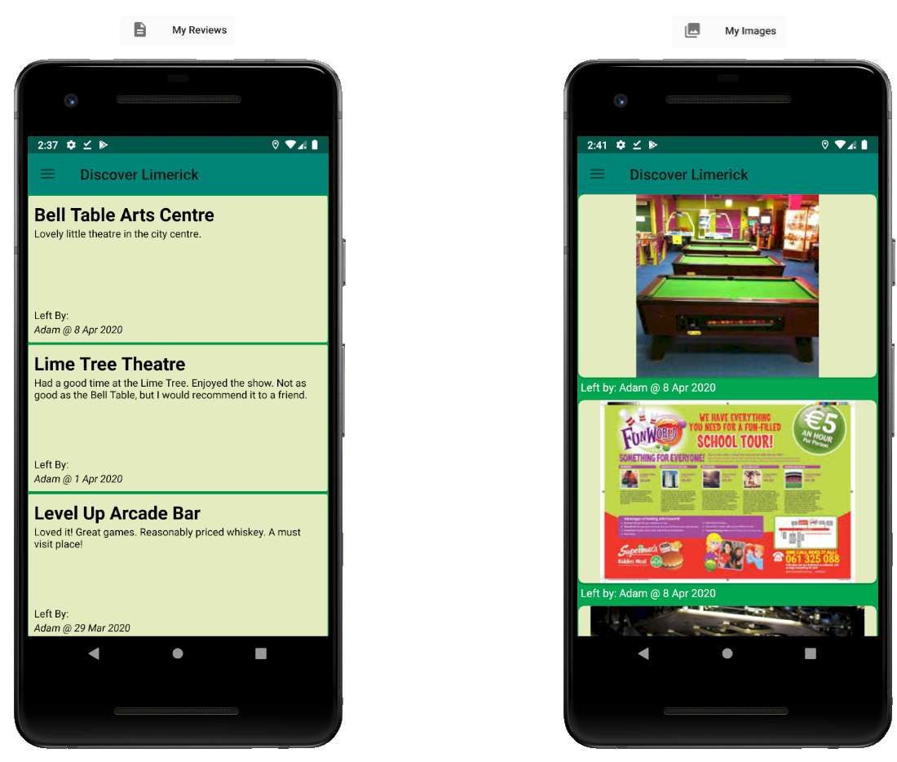

# Navigation Structure of the Discover Limerick App
These images show a typical navigation path from the app home screen to a location screen. 
The first two screens contain recycler views which use custom adpters. 
The bottom half of the home screen is an ImageFlipper that shows eight random images from the database.

---

These are four of the screens that can be accessed from the location screen. 
The button used to reach each screen is shown above it.

---

These images show the screen for the Google Maps Activity for a location, and the navigation drawer menu. 
There are two versions of the drawer menu; the default menu and the menu for logged in users.

---

A logged in user can view all the reviews they have left in one screen, and all the images thay have left in another. 
These screens can be accessed from the relevant navgation drawer menu. 
The relevant menu button is shown above each screen.

---

The following three images show the Text-to-Speech(TTS) control button in its various states, which can be found on the location screen. 
When the button is in the first state shown, the TTS engine is ready to read the location description. 
While the description is being read, the button is in the second state shown. 
Pressing the button while the TTS is speaking will stop the TTS. 
If the user navigates to different screens while the TTS is speaking, this button will remain visible so that they can stop the TTS without returning to the location screen. 
The TTS will return to its normal state once it has finished or been interrupted. 
The third state shown is used to signal that there has been an error with the TTS engine, and the functionality is not currently available.

